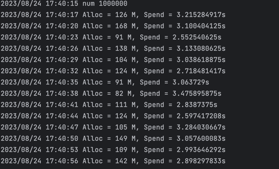
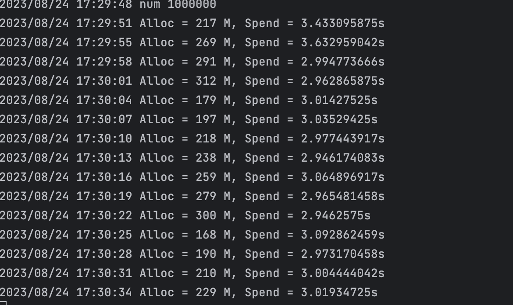
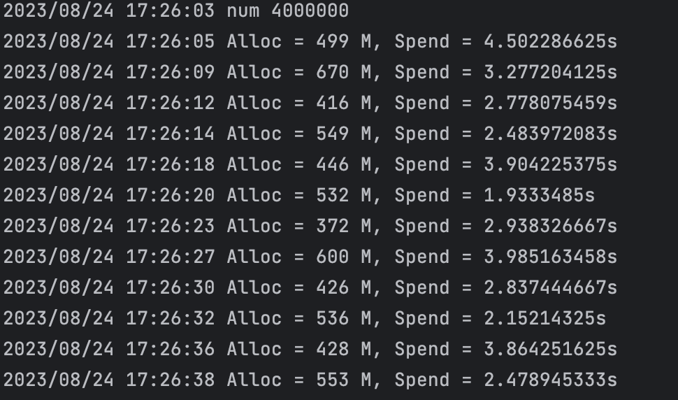
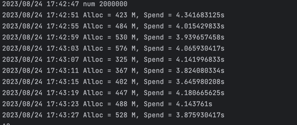

# Cron

更简单的定时任务。
支持秒级定时，可以修正执行时间，保证整秒的时候才执行，更准时。
放弃crontab格式，可以指定何时开始执行，设置更方便。
并发性能更高。

[cron-simple](https://github.com/lizongying/cron/tree/simple)

## Features

* 支持秒级定时，可以修正执行时间，保证整秒的时候才执行，更准时。
* 放弃crontab格式，可以指定何时开始执行，设置更方便。
* 并发性能更高。

## Install

```shell
go get -u github.com/lizongying/cron@simple
```

## Usage

### job method

* 设定执行周期

```go
EverySecond(v uint8) *Job
EveryMinute(v uint8) *Job
EveryHour(v uint8) *Job
EveryDay(v uint8) *Job
EveryMonth(v uint8) *Job
EveryWeek(v uint8) *Job
```

* 设定开始时间
```go
// 忽略错误
MustSince(timeStr string) *Job

// 根据时间字符串，设定开始时间
// 比如定时04:05，每5分钟执行一次。
// 若当前时间03:06，会在04分05秒开始执行；
// 若当前时间05:02，会在09分05秒开始执行。
// 2006-01-02 15:04:05
// 01-02 15:04:05
// 02 15:04:05
// 15:04:05
// 04:05
// 05
// 未设置部分以当前时间填充
Since(timeStr string) (job *Job, err error)

// 直接设置开始时间
SinceTime(t time.Time) *Job

```

* 设定回调函数

```go
Callback(callback Callback) *Job
```

* 获取下次执行时间。

```go
NextTime() time.Time
```

### cron options

* 使用自定义日志

```go
WithLogger(logger Logger) Options
```

* 日志输出到控制台

```go
WithStdout() Options
```

* 修正执行时间，会在整秒的时候才执行，所以初次执行会有不到一秒的延时

```go
WithFix() Options

```

### run

```go
package main

import (
	"github.com/lizongying/cron"
)

func main() {
	logger := cron.NewLoggerStdout()
	c := cron.New(cron.WithStdout())
	id := c.MustAddJob(new(cron.Job).
		EverySecond(10).
		MustSince("10:15").
		Callback(func() {
			logger.Info("callback")
		}))
	logger.Info("id", id)
	c.MustStart()
	select {}
}

```

### stop

```go
package main

import (
	"github.com/lizongying/cron"
)

func main() {
	c := cron.New()
	c.MustStop()
}

```

## Tips

* 建议秒级别最大任务控制在4,000,000(Apple M1 Pro, 32 GB))以内，防止任务超时。可能支持更大数量，请自行测试。

## Performance

结论：和robfig/cron对比，相同数量任务，内存约为robfig/cron一半；任务容量（任务不超时最大数量）约为robfig/cron的四倍

如果任务执行时间一直超过3分钟，可以认为到了最大容量

robfig/cron

```go
package main

import (
	cron "github.com/robfig/cron/v3"
	"log"
	"runtime"
	"time"
)

func main() {
	num := 1000000
	begin := time.Now()
	c := cron.New(cron.WithSeconds())
	for i := 1; i <= num; i++ {
		v := i
		_, _ = c.AddFunc("@every 3s", func() {
			if v == num {
				var mem runtime.MemStats
				runtime.ReadMemStats(&mem)
				now := time.Now()
				log.Printf("Alloc = %v M, Spend = %v\n", mem.Alloc/1024/1024, now.Sub(begin))
				begin = now
			}
		})
	}
	c.Start()
	log.Println("now", begin)
	select {}
}

```

lizongying/cron

```go
package main

import (
	"github.com/lizongying/cron"
	"log"
	"runtime"
	"time"
)

func main() {
	num := 4000000
	begin := time.Now()
	c := cron.New(cron.WithFix())
	for i := 1; i <= num; i++ {
		v := i
		_ = c.MustAddJob(new(cron.Job).
			EverySecond(3).
			Callback(func() {
				if v == num {
					var mem runtime.MemStats
					runtime.ReadMemStats(&mem)
					now := time.Now()
					log.Printf("Alloc = %v M, Spend = %v\n", mem.Alloc/1024/1024, now.Sub(begin))
					begin = now
				}
			}))
	}
	c.MustStart()
	log.Println("num", num)
	select {}
}

```

lizongying 1,000,000:



robfig 1,000,000:



lizongying 4,000,000:



robfig 2,000,000 robfig到了2,000,000就会出现任务超时情况:




